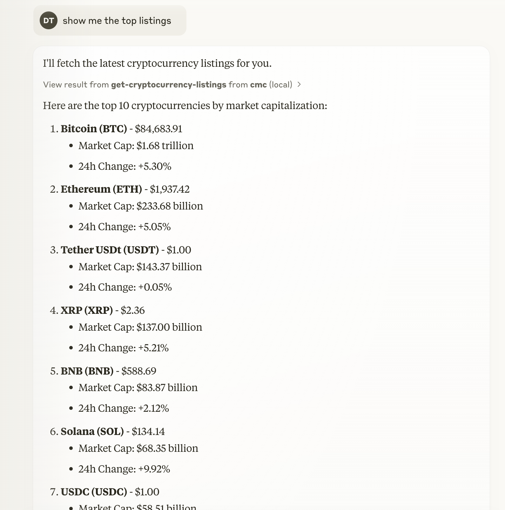
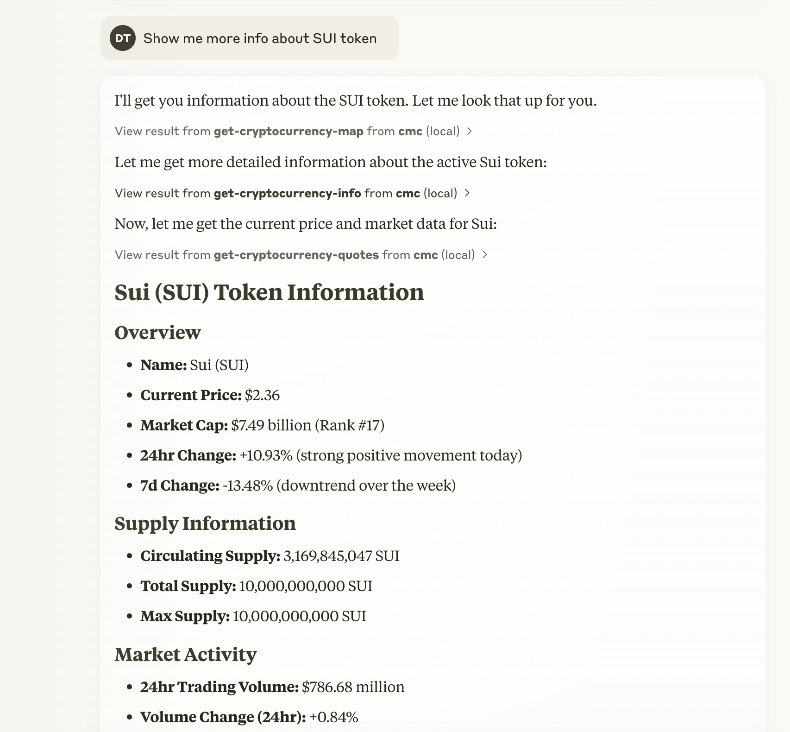

# CoinMarketCap MCP Server

A [Model Context Protocol](https://modelcontextprotocol.io/introduction) (MCP) server that provides Claude AI with real-time access to cryptocurrency data from the CoinMarketCap API.

## Features

This server provides the following tools to Claude:

- **get-cryptocurrency-listings**: Get the latest cryptocurrency market data
- **get-cryptocurrency-quotes**: Retrieve quotes for specific cryptocurrencies
- **get-cryptocurrency-map**: Fetch the mapping of cryptocurrencies to CoinMarketCap IDs
- **get-cryptocurrency-info**: Get detailed metadata for specific cryptocurrencies
- **get-global-metrics**: Access global cryptocurrency market metrics
- **get-exchange-listings**: Get information about cryptocurrency exchanges

## Prerequisites

- Node.js or Bun
- A CoinMarketCap API key (get one at [pro.coinmarketcap.com](https://pro.coinmarketcap.com))

## Integration with Claude Desktop

To integrate this MCP server with Claude Desktop:

1. Locate the Claude Desktop configuration file:

    - On macOS: `~/Library/Application\ Support/Claude/claude_desktop_config.json`

2. Add the following configuration to the file:

```json
{
    "mcpServers": {
        "cmc": {
            "command": "node",
            "args": ["/path/to/cmc-mcp/build/index.js"],
            "env": {
                "COINMARKET_API_KEY": "your-api-key-here"
            }
        }
    }
}
```

Make sure to replace `/path/to/cmc-mcp` with the actual path to your installation and add your actual CoinMarketCap API key.

> Note: This repository includes the prebuilt JavaScript file in the `build` directory, so you can use it directly without having to build the TypeScript code yourself.

````

Filepath: README.md
Replace lines: 21-41
```markdown
## Installation

1. Clone this repository
2. Install dependencies:

```bash
# Using npm
npm install

# Using bun
bun install
````

3. (Optional) Build the TypeScript code:

    Note: The repository includes a prebuilt version in the `build` directory, so this step is optional if you don't need to modify the code.

```bash
# Using npm
npm run build

# Using bun
bun run build
```

## Usage in Claude

Once configured, you can ask Claude to perform various cryptocurrency-related tasks:

- "Show me the top 10 cryptocurrencies by market cap"
- "What's the current price of Bitcoin and Ethereum?"
- "What are the global cryptocurrency market metrics today?"
- "Tell me about the Binance exchange"

## Screenshots

### Top Cryptocurrencies



### Cryptocurrency Metadata



### Market Metrics


## Development

This project uses TypeScript and the Model Context Protocol SDK to build a server that communicates with Claude AI.

To modify the available tools or add new endpoints, edit the `src/index.ts` file and rebuild the project.
